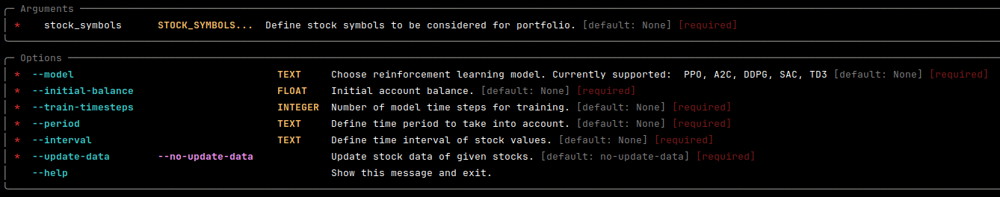
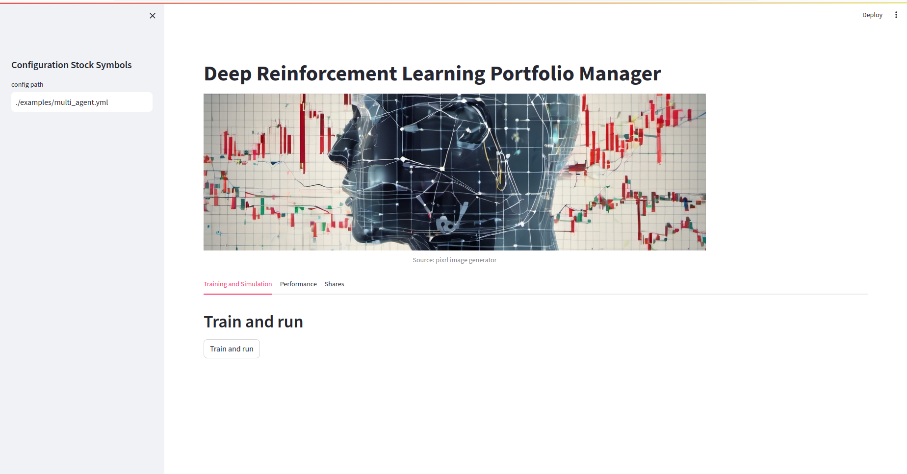
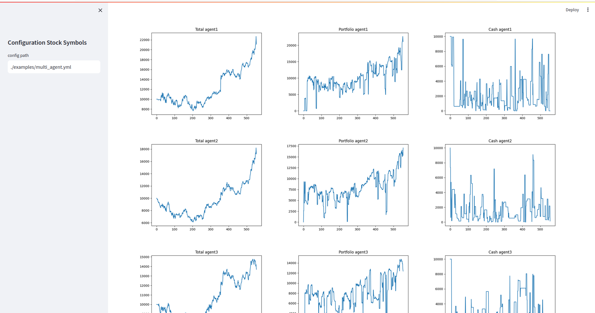
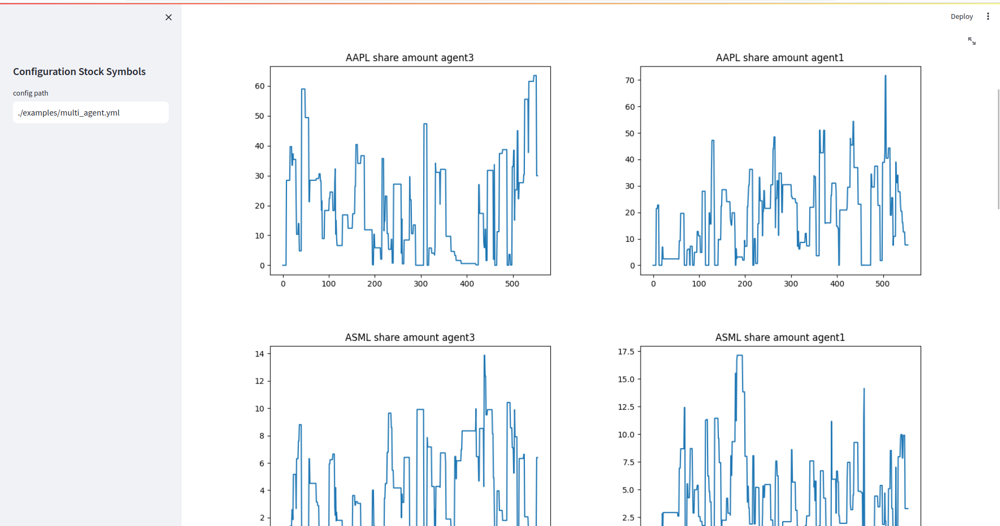

# Deep-Reinforcement-Learning-Stock-Portfolio-Manager

*Source: pixlr image generator*
 
Welcome to the Stock-Trading-Portfolio-Manager with Deep-Reinforcement-Learning! 
This project, developed in my free time, aims to provide a comprehensive solution for 
managing stock trading portfolios using reinforcement learning techniques. Unlike 
traditional portfolio managers, this repository differentiates itself by offering a 
flexible framework that can accommodate an arbitrary number of stocks and features a 
continuous action space, making it suitable for a wide range of trading strategies.

## Key Features

- **Flexible Stock Selection**: The portfolio manager can accommodate an arbitrary number of stocks, allowing users to customize their portfolios based on their preferences and investment strategies.

- **Continuous Action Space**: The reinforcement learning framework features a continuous action space with dimensions `[(buy, sell) * number_of_stocks, 1]`, enabling the buying and selling of any available amount of stocks at any given time step. This provides users with fine-grained control over trading decisions.

- **Variable Time Period**: Users have the flexibility to specify the time period for which historical market data will be considered, allowing for analysis and optimization over different time horizons.

- **Variable Data Points Interval**: The framework supports variable data points intervals, enabling users to customize the granularity of historical market data used for training and evaluation.

- **Lightweight Codebase for Customization**: The codebase is designed to be lightweight and easily customizable, making it straightforward for users to extend and modify the functionality to suit their specific requirements and trading strategies.

- **Graphical User Interface (GUI) with Streamlit**: The project includes a graphical user interface built with Streamlit, providing an intuitive and interactive environment for users to interact with the portfolio manager, visualize trading strategies, and analyze portfolio performance.

## Limitations

- **No Transaction Costs**: The current implementation does not consider transaction costs associated with buying and selling stocks.

- **Limited Data Source**: Historical market data is sourced exclusively from Yahoo Finance (yfinance), limiting the available data to what is provided by this source.

- **No Short Selling**: The framework does not support short selling, i.e., selling stocks that the user does not own with the intention of buying them back at a lower price.

- **No Leveraging**: Leveraging, the practice of borrowing funds to increase investment exposure, is not supported in the current implementation.

- **No Price Impact on Purchase**: The framework does not model the price impact on purchases, which can occur when buying large quantities of stocks in the market.

## Disclaimer

The Stock-Trading-Portfolio-Manager with Deep-Reinforcement-Learning is provided for educational and informational purposes only. It is not intended to be a substitute for professional financial advice or to be used as a tool for making investment decisions. 

Trading stocks involves inherent risks, including the risk of loss of capital. The performance of trading strategies generated by the software may vary and past performance is not indicative of future results. 

Users of this software are solely responsible for their investment decisions and should consult with a qualified financial advisor before making any investment decisions. The creators of this software disclaim any and all liability for any investment losses or other damages resulting from the use of this software.

By using this software, you acknowledge and agree to the terms of this disclaimer.

## Getting Started

To get started with using the Stock Trading Portfolio Manager, follow these steps:

1. **Clone the Repository**: Clone this repository to your local machine using Git:
    ```
    git clone https://github.com/julblanke/Deep-Reinforcement-Learning-Stock-Portfolio-Manager
    ```

2. **Install Dependencies**: Navigate to the project directory and install the required dependencies using pip:
    ```
    pip install -r requirements.txt
    ```


3. **Run the Application**: Once the dependencies are installed, you can run the application from the project directory:
    ```
    python drlpm/drlpm_run.py NVDA ASML AMZN --period="2y" --interval="1d" --initial-balance=10000 --train-timesteps=10000 --update-data
    ```
    Use option --help to get information on all possible configurations.
    
    Or use streamlit GUI via
    ```
    streamlit run streamlit/streamlit_app.py
    ```
    

4. **Performance**: Watch performance of your model in the streamlit directory
    ```
    cd streamlit/result_images
    ```
    or use the streamlit GUI to watch performance of portfolio
    
    and to get insight in share amounts.
    

## Outlook

The current version of the repository is in the early stages of development and may exhibit instability and limited functionality. It is important to note that the software is not suitable for production use at this time.

I am actively working on an advanced version of the portfolio manager that incorporates more sophisticated algorithms and improved learning capabilities. This advanced version aims to address the limitations of the current version and provide a more robust and reliable solution for managing stock trading portfolios using reinforcement learning techniques.

Thank you for your interest in the project, and stay tuned for updates on its development progress and future releases.


## License

This project is licensed under the MIT License, which means you are free to use, modify, 
and distribute the code for any purpose. See the license file for more details.
